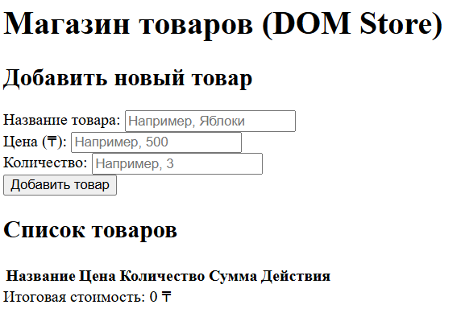

# DOM Store — Lab 5

## Автор
**Имя:** Дана Кармантаева (Karmantaeva Dana)  
**Группа:** IT1-2310  
**Репозиторий:** https://github.com/danak2404-source/dom-store-karmantaeva

---

## Как открыть проект

1. Откройте файл `index.html` прямо в браузере (двойным кликом).
2. Или заново запустите проект через Live Server в VS Code / GitHub Codespaces.

---

## Какие события я обработала и почему

1. **`submit` на форме (`#add-product-form`):** Перехвачен дефолтный сабмит страницы через `e.preventDefault()`, чтобы выполнять валидацию в DOM без перезагрузки страницы и добавлять валидированный товар в экземпляре `Store`.
2. **`click` с делегированием событий на таблице (`#product-list`):** Вместо навешивания отдельных слушателей клика на каждую кнопку удаления и изменения количества, установлен один единый слушатель на родительский элемент таблицы. Он определяет целевую кнопку через `e.target.dataset.action` и считывает `id` из дата-атрибута `tr.dataset.id`.
3. **`click` на кнопках изменяет `qty` и удаляет элемент:** При нажатии на `+` или `-` изменяется количество товара, а при попытке уменьшить `qty` ниже 1 товар автоматически удаляется из `Store`.

---

## Скриншот страницы

